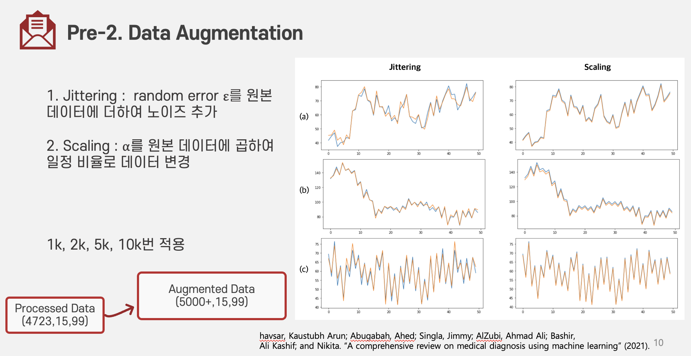

# PDA Classfication
&nbsp;신생아에게서 희귀하게 발생하는 "동맥관 개존증" 질병을 미리 예측하는 딥러닝 모델 구현 프로젝트입니다. 99개 dimension을 가진 406개 dynamic length 데이터에 대한 전처리를 진행했습니다.

## 1. Data 전처리
### 1) Pre-Zero Padding

&nbsp;최소 1, 최대 15일자 길이의 데이터를 길이 15로 일정하게 맞추었습니다. pre zero padding을 진행하였는데, 길이 자체가 학습의 대상이 되는 것을 막기 위해 n일치 데이터를 n개의 데이터로 쪼갠 뒤 padding 처리하였습니다. 소스코드는 [preprocess.ipynb](https://github.com/BuchuKim/pda-classification/blob/src/preprocess.ipynb)에서 확인 가능합니다.   
 

### 1-2. Augmentation

&nbsp;부족한 데이터 수를 보완하기 위해 augmentation을 진행했습니다. 임의 노이즈를 추가하는 jittering, 일정 비율로 데이터를 변경하는 scaling 방식을 채택했습니다. 각각 1k, 2k, 5k, 10k번 적용하여 augmentation의 효과를 확인했습니다. 소스코드는 [augmentation.py](https://github.com/BuchuKim/pda-classification/blob/src/augmentation.ipynb)에서 확인 가능합니다.   

 

## 2. 결과

&nbsp;Agumentation을 진행했을 때 비교군에 대해 전반적으로 좋은 점수를 보였고, scaling을 5000번 진행했을 때 가장 좋은 결과를 달성했습니다.   

 
 

